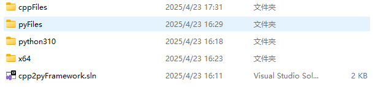
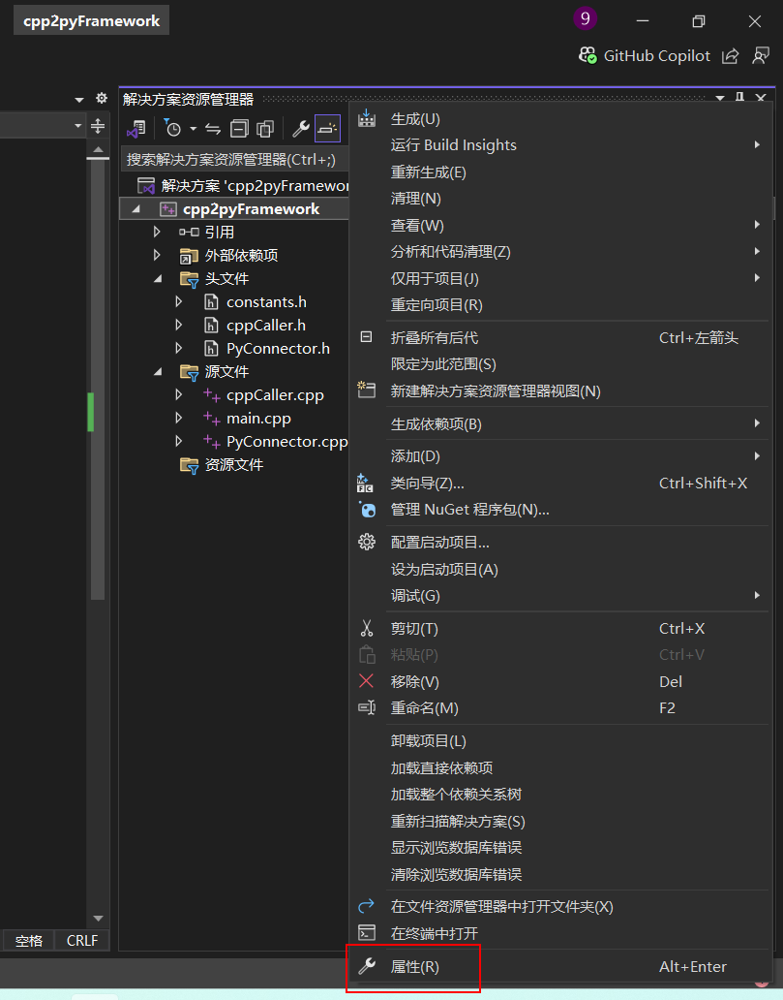
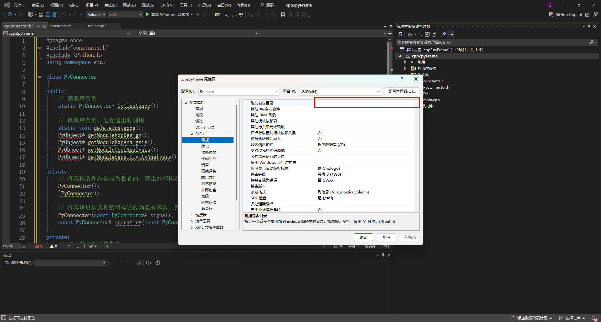
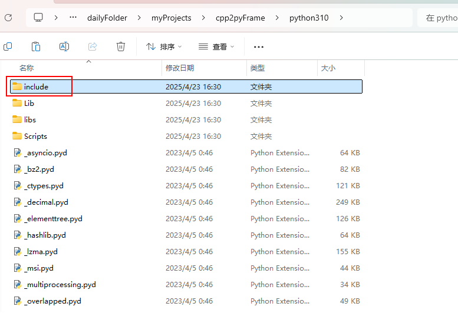
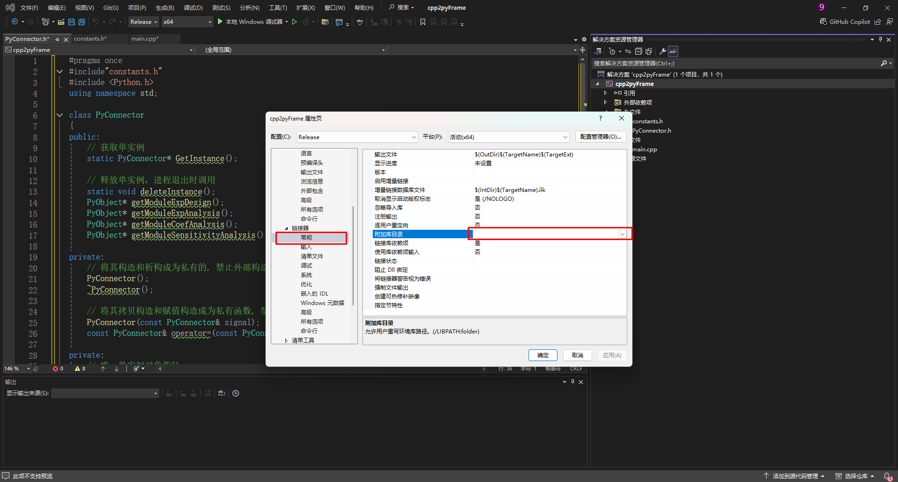
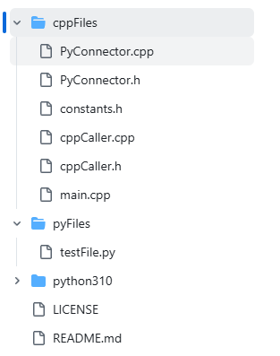
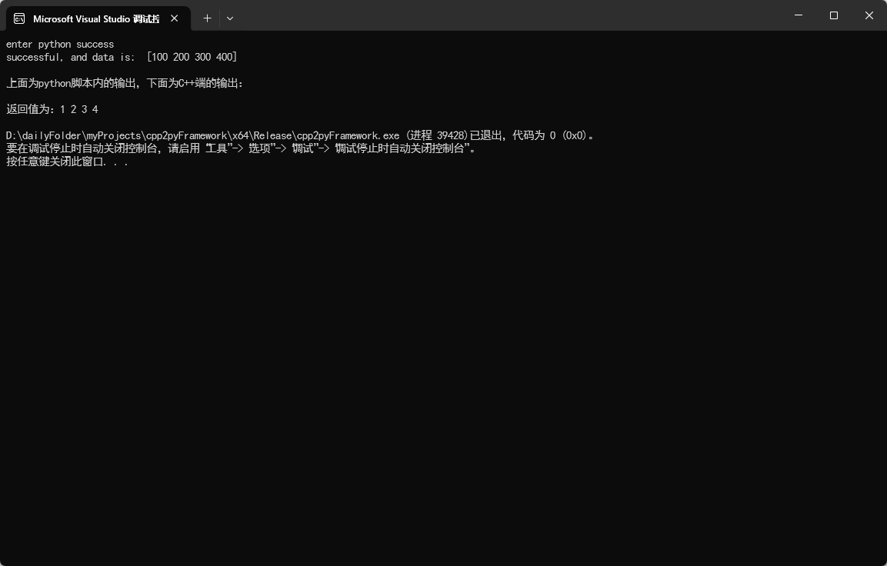
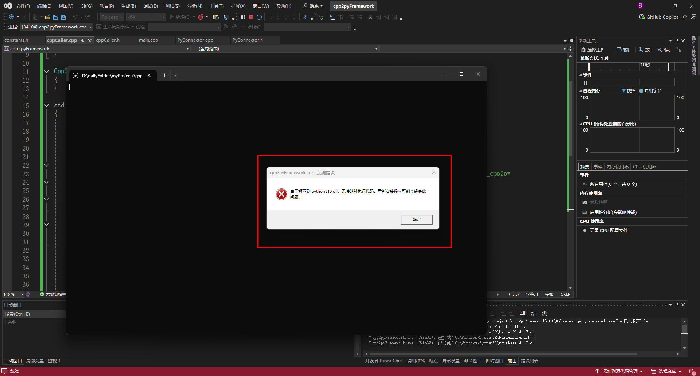
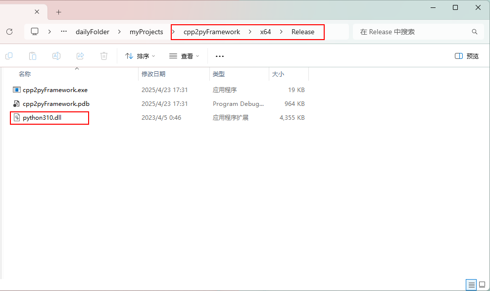

# 引言

在上一篇文章 [C++调用Python方法详解（同样适用导入第三方包的python脚本）](https://blog.csdn.net/Anzerwhite/article/details/142625045)中提到了如何用C++调用Python的基本流程，这篇文章在其流程基础上提出了一种代码组织方案，进行架构优化的同时，方便开箱即用。

完整代码可参见：

下面简单展示和介绍代码组织流程（**具体配置过程请看上一篇文章，方便理解**）

------

# 环境准备

- Microsoft Visual Studio（笔者所用版本为2022 Community）
- 确保机器有可用的python解释器，且对应的第三方包都以导入（即pip install过了）。**\*注：****笔者使用的为embeddable python3.10。关于是否使用embeddable python可以视项目需求而定，使用embeddable python适合直接将**源码**等打包交付（甲方单位没法联网）的情况，若无特殊需求可以直接使用常规的python环境，如**conda**或其他**虚拟环境**均可，python解释器能用就行。*
- 在VS运行的时候记得选**release模式**，debug模式会有问题。

------

# 配置项目

## 创建新项目

在visual studio中创建一个新项目，如控制台应用程序（不建议选择空项目，可能会在配置依赖库时缺少选项），或从当前代码中导入。**笔者的.****sln****文件位置如下，涉及配置时的相对路径设置。**



## 配置链接目录

右键点击项目，选择属性，开始配置链接目录



## 设置附加包含目录

在“C/C++”选项卡下，找到“常规”部分，设置“附加包含目录”，将python解释器的包含目录（也就是python安装路径下的include文件夹）填入



**\*注：笔者使用的为embed python，对应python.exe相对路径（相对于.*****\*sln*****\*）为./python.exe，可作为其他相对路径的参考。若使用其他环境的*****\*解释器*****\*，请使用绝对路径。***



找到待调用python脚本的环境下的python解释器的路径（一定要是相同python解释器版本），python.exe同级目录下的include文件夹就是我们的目标路径，将该路径复制后添加到“附加包含目录”这里

## 设置附加库目录

在“链接器”选项卡下，找到“常规”部分，设置“附加库目录”，将python解释器的库目录（也就是python安装路径下的libs文件夹）填入



将该libs文件夹的路径填入

## 设置附加依赖项

在“链接器”选项卡下，找到“输入”部分，设置“附加依赖项”，将python解释器的对应的lib文件（也就是python安装路径下的libs文件夹中的python310.lib文件【根据python版本不同名称也不同，大致格式为pythonXXX.lib】）填入

## **记得左上角要为Release！！**

# 项目结构



## cppFiles：存放C++文件的文件夹

- PyConnector.h和PyConnector.cpp为链接python解释器的文件，应用单例模式，将python解释器的初始化和释放都放到了程序运行和结束的时刻，减少解释器反复初始化与销毁，提高代码效率。
- constants.h 为常量文件，主要存放PyConnect所需要的一些配置常量，单独写成一个文件与PyConnect解耦。
- cppcaller.h和cppCaller.cpp为需要调用python的类文件，封装业务流程，是使用者定制自身程序业务的地方。
- main.cpp为程序入口文件，用于启动程序

## pyFiles：存放被调用的python文件的文件夹

- testFiles.py 为测试用的python文件，用户可以自己定制该文件的逻辑，也可存放多个文件，只要在constants.h和PyConnector.h和PyConnector.cpp中修改相应配置即可。

------

## pyFiles中的文件描述

### testFiles.py

```python
import numpy as np

print('enter python success')  # 成功找到该脚本


def test_cpp2py(data):
    """
    一个含参函数，用于测试cpp文件调用含第三方包的python脚本
    :param data: 一个测试列表
    :return:
    """
    data_after_np = np.array(data)
    print('successful, and data is: ', data_after_np)  # 输出
    return [1, 2, 3, 4]  # 这里笔者偷懒就直接传一个固定列表返回给调用方了
```

一个简单的函数，导入了第三方包numpy（一定要给使用的解释器导入这玩意，如果使用笔者代码仓库中的embed python，则可以在其目录下调用命令行执行 python.exe -m pip install xxx 来导入第三方包） 

## cppFiles中的文件描述

### constants.h

```c++
#pragma once
#define SYS_PATH "path" 
#define P_PATH "./pyFiles" // 这里改成.py/.pyd文件所在目录的路径,原理类似于环境变量
#define P_PATH_PACKAGES "./python310/Lib/site-packages"  // 这里改成所用的python解释器所pip的第三方包的路径

// 以下为所调用的python文件的名称(无需后缀)，写作常量方便管理
#define	TESTFILE_MODULE "testFile"
```

- SYS_PATH：环境变量的参数，无需修改。
- P_PATH：python文件所在的目录，若使用了该架构则不用修改。
- P_PATH_PACKAGES：python解释器目录下的 /Lib/site-packages文件夹路径，这里使用的是相对路径。若使用的不是embed python，则需要填写使用的python解释器对应的site-packages文件夹的绝对路径；反之无需修改。
- TESTFILE_MODULE：为所调用的python文件的名称，可以按自己需求修改

### PyConnector

#### PyConnector.h

```c++
#pragma once
#include"constants.h"
#include <Python.h>

class PyConnector
{
public:
	// 获取单实例
	static PyConnector* GetInstance();

	// 释放单实例，进程退出时调用
	static void deleteInstance();
	PyObject* getModuleTest();


private:
	// 将其构造和析构成为私有的, 禁止外部构造和析构
	PyConnector();
	~PyConnector();

	// 将其拷贝构造和赋值构造成为私有函数, 禁止外部拷贝和赋值
	PyConnector(const PyConnector& signal);
	const PyConnector& operator=(const PyConnector& signal);

private:
	// 唯一单实例对象指针
	static PyConnector* ptr_PyConnector;
	PyObject* pModule_TESTFILE;
};
```

采用单例模式，减少python相关文件的初始化和销毁，提升性能。

在这里需要修改的地方为最后的 pModule_TESTFILE，表示链接的python文件的模块。一个python文件对应一个模块，若有多个文件，则需要增加这类变量。

#### Pyconnector.cpp

```c++
#include "PyConnector.h"
#include <iostream>

// 代码一运行就初始化创建实例 ，本身就线程安全
PyConnector* PyConnector::ptr_PyConnector = new (std::nothrow) PyConnector();

PyConnector* PyConnector::GetInstance()
{
	return ptr_PyConnector;
}

// 删除实例
void PyConnector::deleteInstance()
{
	if (ptr_PyConnector)
	{
		delete ptr_PyConnector;
		ptr_PyConnector = nullptr;
	}
}

PyConnector::PyConnector()
{
    // 初始化python解释器
	Py_Initialize(); 

    // 配置环境变量
	PyObject* sysPath = PySys_GetObject(SYS_PATH);
	PyObject* pPath = PyUnicode_FromString(P_PATH);
	PyObject* pPath_packages = PyUnicode_FromString(P_PATH_PACKAGES); 
	PyList_Append(sysPath, pPath);
	Py_DECREF(pPath); // 释放对象
	PyList_Append(sysPath, pPath_packages);
	Py_DECREF(pPath_packages); // 释放对象

    // 导入名为testFile的Python模块
	pModule_TESTFILE = PyImport_ImportModule(TESTFILE_MODULE); 

}

PyConnector::~PyConnector()
{
    Py_Finalize(); // 结束python解释器
}

// 获取对应python文件的模块
PyObject* PyConnector::getModuleTest() {
	return pModule_TESTFILE;
}


```

在构造函数中初始化python解释器，并进行相应的配置（包括配置环境变量和导入pytohn模块等）。

用户需要修改的地方主要为最后的模块获取函数，如果有多个python模块（即上文提到的多个python文件），则需要实现多个模块获取函数，记得在头文件中也添加声明。

### CppCaller

#### cppCaller.h

```c++
#pragma once
#include<Python.h>
#include "constants.h"
#include<vector>

class CppCaller {
public:
	CppCaller();
	~CppCaller();

    // 你自己的业务函数
	std::vector<int> testFn(std::vector<int> data);

private:
    // 该类对应调用的python模块，可写多个，但从职责设计角度上建议只调用一个模块，减少耦合
	PyObject* pModule;
};

```

- testFn：这里的testFn为业务函数，用户可定制化自己的业务内容
- pModule：该类对应调用的python模块，可写多个，但从职责设计角度上建议只调用一个模块，减少耦合

#### cppCaller.cpp

```c++
#include "cppCaller.h"
#include "PyConnector.h"
#include<vector>

CppCaller::CppCaller()
{
    // 从pyConnect单例中获取python模块实例
    pModule = PyConnector::GetInstance()->getModuleTest();
}

CppCaller::~CppCaller()
{
}

std::vector<int> CppCaller::testFn(std::vector<int> data)
{

    // 声明一个用于接收结果的数组
    std::vector<int> result{};

    // 下面实现对.pyd文件中的函数的操作（前提是前面的操作没问题，pModule不会是空指针
    if (pModule != nullptr) {
        PyObject* pFunc = PyObject_GetAttrString(pModule, "test_cpp2py"); // 获取函数，这里填写要调用的函数名，笔者这里是test_cpp2py
        if (pFunc && PyCallable_Check(pFunc)) { // 判断该函数是否存在且可调用

            // 创建参数，由于c++和python的类型不对应，所以要转化
            // 这里根据传入的vector类型的data来创建一个对应列表list
            PyObject* pData = PyList_New(data.size());
            for (int i = 0; i < data.size(); ++i) {
                PyList_SetItem(pData, i, PyLong_FromLong(data[i])); // 这里要对data[i]转化为python类型
            }

            // 构建一个参数列表，第一个参数为参数列表的参数数量，这里为1
            PyObject* pArgs = PyTuple_Pack(1, pData);
            // 调用该函数
            PyObject* pValue = PyObject_CallObject(pFunc, pArgs); // 调用函数
            Py_DECREF(pArgs);

            // 处理返回值
            if (pValue != nullptr) {
                // 从pValue中取值
                for (Py_ssize_t i = 0; i < PyList_Size(pValue); ++i) {
                    result.push_back(PyLong_AsLong(PyList_GetItem(pValue, i)));
                }
                Py_DECREF(pValue);
            }
            Py_DECREF(pFunc);
        }
    }
    else {
        // 证明有问题，pModule为空指针了
        PyErr_Print(); // 打印错误信息
    }
    return result; // 返回结果
}

```

- 构造函数中获取当前类所需要调用的python模块对象，按自己的模块名称修改
- testFn为业务函数，主要流程为：**创建和转化参数 -> 构建参数列表 -> 传入参数，调用函数 -> 获取返回值进一步处理；**该部分为用户自定义部分，参数的构建和传入所对应的函数可以参考网上的其他文档，这里不再赘述。

### main.cpp

```c++
#include<iostream>#include"cppCaller.h"#include<vector>using namespace std;

int main() {
    CppCaller cppCaller{}; // 初始化一个对象// 调用测试函数，查看是否成功调用python脚本
    vector<int> result = cppCaller.testFn({ 100, 200, 300, 400 });
    cout << "\n上面为python脚本内的输出，下面为C++端的输出：\n";
    cout << "\n返回值为：";for (int item : result) {
        cout << item << ' ';
    }
    cout << endl;
return 0;
}
```

启动即可得到以下输出



# 可能存在的问题

## 1、找不到pythonxxx.dll文件(这里的xxx代指版本)



**解决方法：** 尝试将python目录下的pythonxxx.dll拷贝一份放到生成的release文件目录下


